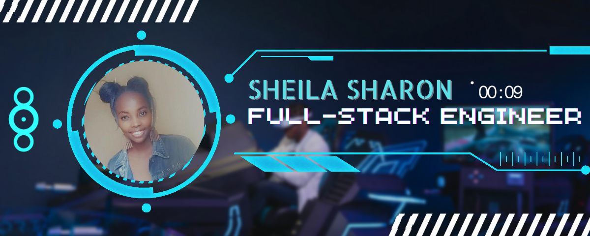
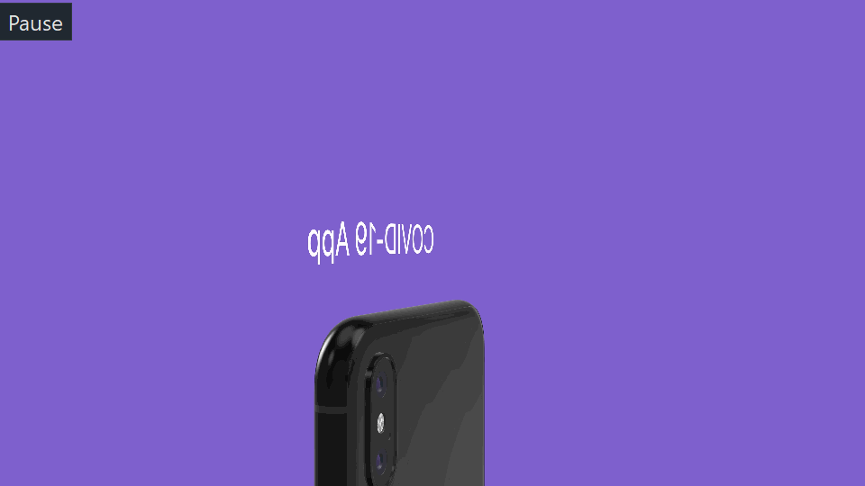

<h1>Hi , I'm Sheila Sharon 👋🏾 👩🏾‍💻</h1>

## Full-Stack Engineer
- 👯 I’m looking to collaborate on MERN Stack projects
- 💬 Ask me about **React, Node, Springboot**
- 🌱 I’m currently learning DevOps
- ⚡ Fun fact I do minature sculptures and glass paintings
- 👨‍💻 All of my projects are available at [https://devsheila.github.io/sheilaSite/](https://devsheila.github.io/sheilaSite/)
- 📄 [Resume](https://drive.google.com/file/d/1gyUDHu3gI_cWaxU6TmGkp8w6V_iOQfSv/view?usp=drive_link)

## Connect With Me

 
 
 
 

## Skills

 

## Projects 

<h3 align="left">Support:</h3>

  
 
